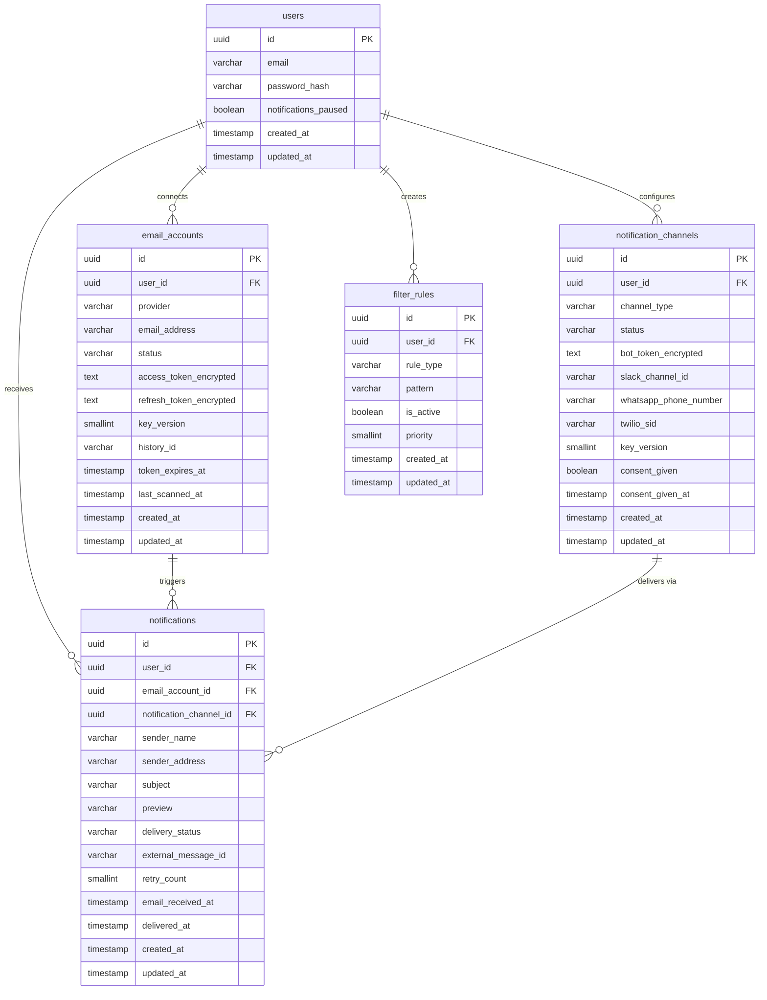
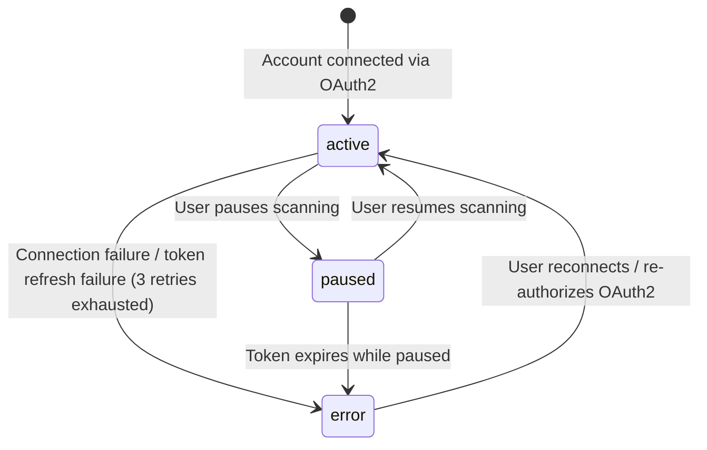
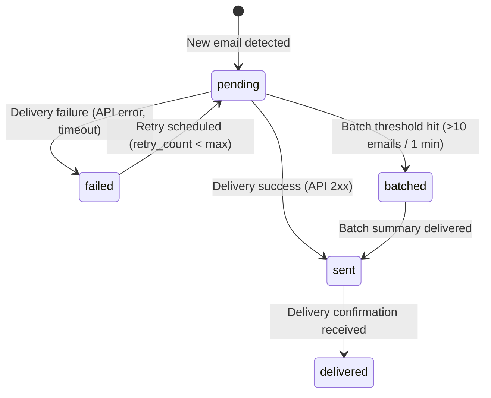
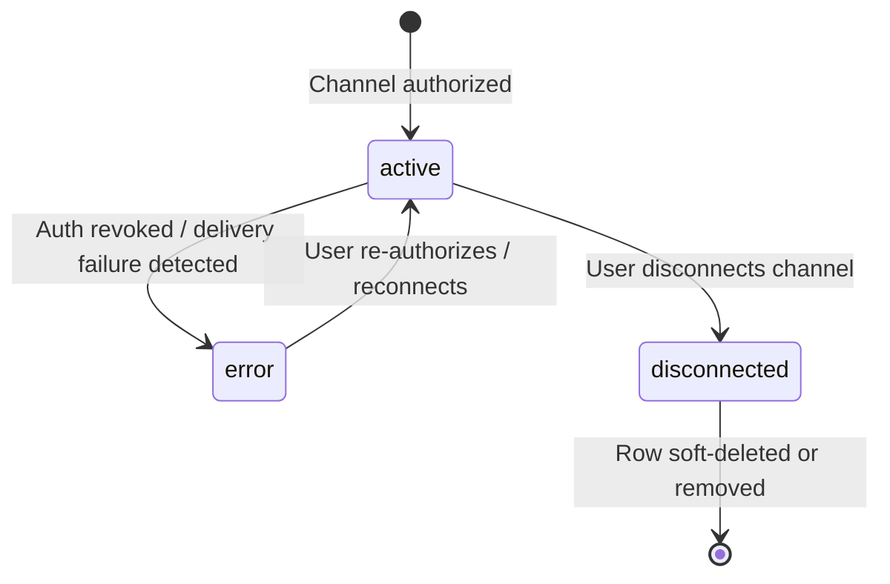

# Data Model: Email Scan & Mobile Notifications

**Branch**: `001-email-scan-notify` | **Date**: 2026-02-21 | **Spec**: [spec.md](./spec.md) | **Research**: [research.md](./research.md)

---

## Entity Relationship Diagram



---

## Entity Definitions

### 1. `users`

The person using the system. Owns email accounts, notification channels, and filter rules.

| Column | Type | Constraints | Description |
|---|---|---|---|
| `id` | `UUID` | `PK, DEFAULT gen_random_uuid()` | Unique user identifier |
| `email` | `VARCHAR(320)` | `NOT NULL, UNIQUE` | Login email address (RFC 5321 max length) |
| `password_hash` | `VARCHAR(72)` | `NOT NULL` | bcrypt hash of user password |
| `notifications_paused` | `BOOLEAN` | `NOT NULL, DEFAULT FALSE` | Global pause toggle for all notifications (FR-007) |
| `created_at` | `TIMESTAMPTZ` | `NOT NULL, DEFAULT NOW()` | Account creation timestamp |
| `updated_at` | `TIMESTAMPTZ` | `NOT NULL, DEFAULT NOW()` | Last modification timestamp |

**Indexes**:

| Name | Columns | Type | Rationale |
|---|---|---|---|
| `pk_users` | `id` | PRIMARY KEY | Default PK lookup |
| `uq_users_email` | `email` | UNIQUE | Login lookup, prevent duplicate accounts |

---

### 2. `email_accounts`

A connected email inbox the system monitors. Stores OAuth2 tokens encrypted with AES-256-GCM and the Gmail `historyId` for incremental sync via `history.list`.

| Column | Type | Constraints | Description |
|---|---|---|---|
| `id` | `UUID` | `PK, DEFAULT gen_random_uuid()` | Unique email account identifier |
| `user_id` | `UUID` | `NOT NULL, FK → users(id) ON DELETE CASCADE` | Owning user |
| `provider` | `VARCHAR(20)` | `NOT NULL, DEFAULT 'gmail'` | Email provider identifier (`gmail`, future: `outlook`) (FR-013) |
| `email_address` | `VARCHAR(320)` | `NOT NULL` | The monitored inbox address |
| `status` | `VARCHAR(10)` | `NOT NULL, DEFAULT 'active'` | Connection status: `active`, `paused`, `error` |
| `access_token_encrypted` | `TEXT` | `NOT NULL` | AES-256-GCM encrypted OAuth2 access token. Format: `base64(IV ‖ ciphertext ‖ authTag)` |
| `refresh_token_encrypted` | `TEXT` | `NOT NULL` | AES-256-GCM encrypted OAuth2 refresh token. Format: `base64(IV ‖ ciphertext ‖ authTag)` |
| `key_version` | `SMALLINT` | `NOT NULL, DEFAULT 1` | Encryption key version for key rotation support |
| `history_id` | `VARCHAR(32)` | | Gmail `historyId` — cursor for `history.list` incremental sync |
| `token_expires_at` | `TIMESTAMPTZ` | | Access token expiry; proactive refresh 5 min before |
| `last_scanned_at` | `TIMESTAMPTZ` | | Timestamp of last successful inbox scan |
| `created_at` | `TIMESTAMPTZ` | `NOT NULL, DEFAULT NOW()` | Row creation timestamp |
| `updated_at` | `TIMESTAMPTZ` | `NOT NULL, DEFAULT NOW()` | Last modification timestamp |

**Indexes**:

| Name | Columns | Type | Rationale |
|---|---|---|---|
| `pk_email_accounts` | `id` | PRIMARY KEY | Default PK lookup |
| `ix_email_accounts_user_id` | `user_id` | BTREE | Fetch all email accounts for a user |
| `uq_email_accounts_user_email` | `(user_id, email_address)` | UNIQUE | Prevent duplicate connections for the same inbox |
| `ix_email_accounts_status` | `status` | BTREE | Scheduled scanner queries active accounts |
| `ix_email_accounts_token_expires` | `token_expires_at` | BTREE | Proactive token refresh scheduler finds soon-to-expire tokens |

---

### 3. `notification_channels`

A delivery destination for notifications. Each row represents a single configured channel (Slack or WhatsApp) for a user.

| Column | Type | Constraints | Description |
|---|---|---|---|
| `id` | `UUID` | `PK, DEFAULT gen_random_uuid()` | Unique channel identifier |
| `user_id` | `UUID` | `NOT NULL, FK → users(id) ON DELETE CASCADE` | Owning user |
| `channel_type` | `VARCHAR(10)` | `NOT NULL` | Channel type: `slack` or `whatsapp` |
| `status` | `VARCHAR(15)` | `NOT NULL, DEFAULT 'active'` | Authorization status: `active`, `error`, `disconnected` |
| `bot_token_encrypted` | `TEXT` | | AES-256-GCM encrypted Slack bot token (`xoxb-…`). NULL for WhatsApp channels |
| `slack_channel_id` | `VARCHAR(20)` | | Slack channel/DM ID for message delivery. NULL for WhatsApp channels |
| `whatsapp_phone_number` | `VARCHAR(20)` | | E.164 formatted phone number. NULL for Slack channels |
| `twilio_sid` | `VARCHAR(40)` | | Twilio Account SID for WhatsApp delivery. NULL for Slack channels |
| `key_version` | `SMALLINT` | `NOT NULL, DEFAULT 1` | Encryption key version for bot_token rotation |
| `consent_given` | `BOOLEAN` | `NOT NULL, DEFAULT FALSE` | WhatsApp opt-in consent flag (required by WhatsApp Business policy) |
| `consent_given_at` | `TIMESTAMPTZ` | | Timestamp when WhatsApp opt-in consent was recorded |
| `created_at` | `TIMESTAMPTZ` | `NOT NULL, DEFAULT NOW()` | Row creation timestamp |
| `updated_at` | `TIMESTAMPTZ` | `NOT NULL, DEFAULT NOW()` | Last modification timestamp |

**Validation Rules**:
- If `channel_type = 'slack'`: `bot_token_encrypted` and `slack_channel_id` MUST be non-null.
- If `channel_type = 'whatsapp'`: `whatsapp_phone_number` and `twilio_sid` MUST be non-null; `consent_given` MUST be `TRUE`.
- `whatsapp_phone_number` MUST match E.164 format: `^\+[1-9]\d{1,14}$`.

**Indexes**:

| Name | Columns | Type | Rationale |
|---|---|---|---|
| `pk_notification_channels` | `id` | PRIMARY KEY | Default PK lookup |
| `ix_notification_channels_user_id` | `user_id` | BTREE | Fetch all channels for a user |
| `uq_notification_channels_user_type` | `(user_id, channel_type)` | UNIQUE | One channel per type per user |
| `ix_notification_channels_status` | `status` | BTREE | Detect errored channels for alerting (FR-011) |

---

### 4. `notifications`

A message sent to the user about a new email. Tracks delivery lifecycle from pending through delivered or failed.

| Column | Type | Constraints | Description |
|---|---|---|---|
| `id` | `UUID` | `PK, DEFAULT gen_random_uuid()` | Unique notification identifier |
| `user_id` | `UUID` | `NOT NULL, FK → users(id) ON DELETE CASCADE` | Recipient user |
| `email_account_id` | `UUID` | `NOT NULL, FK → email_accounts(id) ON DELETE CASCADE` | Source email account that triggered this notification |
| `notification_channel_id` | `UUID` | `NOT NULL, FK → notification_channels(id) ON DELETE CASCADE` | Delivery channel used |
| `sender_name` | `VARCHAR(256)` | `NOT NULL` | Email sender display name |
| `sender_address` | `VARCHAR(320)` | `NOT NULL` | Email sender address |
| `subject` | `VARCHAR(998)` | `NOT NULL` | Email subject line (RFC 2822 max) |
| `preview` | `VARCHAR(150)` | `NOT NULL` | First 150 characters of email body (FR-005) |
| `delivery_status` | `VARCHAR(10)` | `NOT NULL, DEFAULT 'pending'` | Status: `pending`, `batched`, `sent`, `delivered`, `failed` |
| `external_message_id` | `VARCHAR(128)` | | Provider message ID (Slack `ts`, Twilio `MessageSid`) for tracking |
| `retry_count` | `SMALLINT` | `NOT NULL, DEFAULT 0` | Number of delivery retry attempts |
| `email_received_at` | `TIMESTAMPTZ` | `NOT NULL` | When the original email was received in the inbox |
| `delivered_at` | `TIMESTAMPTZ` | | When the notification was confirmed delivered |
| `created_at` | `TIMESTAMPTZ` | `NOT NULL, DEFAULT NOW()` | Row creation timestamp |
| `updated_at` | `TIMESTAMPTZ` | `NOT NULL, DEFAULT NOW()` | Last modification timestamp |

**Indexes**:

| Name | Columns | Type | Rationale |
|---|---|---|---|
| `pk_notifications` | `id` | PRIMARY KEY | Default PK lookup |
| `ix_notifications_user_id` | `user_id` | BTREE | Fetch notification history for a user |
| `ix_notifications_delivery_status` | `delivery_status` | BTREE | Retry scheduler finds `failed`/`pending` notifications |
| `ix_notifications_user_created` | `(user_id, created_at DESC)` | BTREE | Paginated notification history ordered by recency |
| `ix_notifications_channel_status` | `(notification_channel_id, delivery_status)` | BTREE | Per-channel delivery monitoring |
| `ix_notifications_created_at` | `created_at` | BTREE | 30-day retention purge job (Assumptions section) |

---

### 5. `filter_rules`

A user-defined rule that determines which emails trigger notifications. Rules match on sender address or subject keywords (FR-008).

| Column | Type | Constraints | Description |
|---|---|---|---|
| `id` | `UUID` | `PK, DEFAULT gen_random_uuid()` | Unique rule identifier |
| `user_id` | `UUID` | `NOT NULL, FK → users(id) ON DELETE CASCADE` | Owning user |
| `rule_type` | `VARCHAR(10)` | `NOT NULL` | Rule type: `sender` or `subject` |
| `pattern` | `VARCHAR(512)` | `NOT NULL` | Match pattern — email address for `sender`, keyword for `subject` |
| `is_active` | `BOOLEAN` | `NOT NULL, DEFAULT TRUE` | Whether the rule is currently applied |
| `priority` | `SMALLINT` | `NOT NULL, DEFAULT 0` | Evaluation order (lower = higher priority) |
| `created_at` | `TIMESTAMPTZ` | `NOT NULL, DEFAULT NOW()` | Row creation timestamp |
| `updated_at` | `TIMESTAMPTZ` | `NOT NULL, DEFAULT NOW()` | Last modification timestamp |

**Validation Rules**:
- `rule_type` MUST be one of: `sender`, `subject`.
- If `rule_type = 'sender'`: `pattern` MUST be a valid email address.
- If `rule_type = 'subject'`: `pattern` MUST be a non-empty string (keyword or phrase).
- When no filter rules exist for a user, all new emails trigger notifications (default behavior per spec).

**Indexes**:

| Name | Columns | Type | Rationale |
|---|---|---|---|
| `pk_filter_rules` | `id` | PRIMARY KEY | Default PK lookup |
| `ix_filter_rules_user_active` | `(user_id, is_active)` | BTREE | Fetch active rules during email scan |
| `ix_filter_rules_user_type` | `(user_id, rule_type)` | BTREE | Filter evaluation by rule type |

---

## State Machines

### EmailAccount Status



| Transition | Trigger | Side Effects |
|---|---|---|
| `→ active` | OAuth2 authorization success | Begin inbox scanning; register `users.watch()` |
| `active → paused` | User action (FR-007) | Stop scanning; no notifications sent for new emails |
| `paused → active` | User action (FR-007) | Resume scanning from current `historyId` (no backfill) |
| `active → error` | OAuth2 refresh failure after 3 retries | Stop scanning; notify user to reconnect (FR-011) |
| `error → active` | User re-authorizes | New tokens stored; scanning resumes |
| `paused → error` | Token expires during pause | Alert user; require re-authorization on resume |

---

### Notification Delivery Status



| Transition | Trigger | Side Effects |
|---|---|---|
| `→ pending` | Email scan detects new message | Notification row created; queued for delivery |
| `pending → sent` | Provider API returns success | Store `external_message_id`; update `updated_at` |
| `sent → delivered` | Delivery confirmation (Slack ack / Twilio callback) | Set `delivered_at` timestamp |
| `pending → failed` | API error, timeout, or circuit breaker open | Increment `retry_count`; schedule retry with backoff |
| `failed → pending` | Retry scheduler picks up notification | Reset for next delivery attempt |
| `pending → batched` | >10 emails in 1-minute window (FR-010) | Held in memory buffer; summary composed on flush |
| `batched → sent` | Batch window closes; summary notification sent | Single summary notification delivered to channel |

**Retry Policy**: Max 3 retries with exponential backoff (30s, 120s, 480s). After 3 failures, notification remains in `failed` status for manual review.

---

### NotificationChannel Status



| Transition | Trigger | Side Effects |
|---|---|---|
| `→ active` | Slack bot installed or WhatsApp consent given | Channel ready for notification delivery |
| `active → error` | `token_revoked`, `channel_not_found`, or WhatsApp auth failure | Pause delivery on this channel; alert user (FR-011) |
| `error → active` | User re-authorizes Slack or re-links WhatsApp | Resume delivery |
| `active → disconnected` | User removes channel from settings | Stop all delivery; retain row for audit |

---

## Relationships Summary

| Parent | Child | Cardinality | FK Column | ON DELETE |
|---|---|---|---|---|
| `users` | `email_accounts` | 1 : N | `email_accounts.user_id` | CASCADE |
| `users` | `notification_channels` | 1 : N | `notification_channels.user_id` | CASCADE |
| `users` | `filter_rules` | 1 : N | `filter_rules.user_id` | CASCADE |
| `users` | `notifications` | 1 : N | `notifications.user_id` | CASCADE |
| `email_accounts` | `notifications` | 1 : N | `notifications.email_account_id` | CASCADE |
| `notification_channels` | `notifications` | 1 : N | `notifications.notification_channel_id` | CASCADE |

---

## Out-of-Scope (Not Persisted in PostgreSQL)

| Concern | Storage | Rationale |
|---|---|---|
| **Email deduplication** | Redis SET with 48h TTL (`dedup:{userId}`) | O(1) lookup; ~20 MB for 1,000 users; auto-expires (Research §7) |
| **Notification batching state** | In-memory `ConcurrentHashMap<String, BatchWindow>` | Per-user 1-minute tumbling window; flushed by scheduler (Research §8) |
| **Circuit breaker state** | Resilience4j in-memory (per-provider) | Count-based sliding window; no persistence needed (Research §4) |
| **Rate limiter state** | Resilience4j in-memory (per-provider + inbound) | Token bucket counters; reset on restart is acceptable (Research §5) |

---

## DDL Reference

```sql
-- Extension for UUID generation
CREATE EXTENSION IF NOT EXISTS "pgcrypto";

-- 1. users
CREATE TABLE users (
    id              UUID        PRIMARY KEY DEFAULT gen_random_uuid(),
    email           VARCHAR(320) NOT NULL UNIQUE,
    password_hash   VARCHAR(72)  NOT NULL,
    notifications_paused BOOLEAN NOT NULL DEFAULT FALSE,
    created_at      TIMESTAMPTZ  NOT NULL DEFAULT NOW(),
    updated_at      TIMESTAMPTZ  NOT NULL DEFAULT NOW()
);

-- 2. email_accounts
CREATE TABLE email_accounts (
    id                      UUID        PRIMARY KEY DEFAULT gen_random_uuid(),
    user_id                 UUID        NOT NULL REFERENCES users(id) ON DELETE CASCADE,
    provider                VARCHAR(20) NOT NULL DEFAULT 'gmail',
    email_address           VARCHAR(320) NOT NULL,
    status                  VARCHAR(10) NOT NULL DEFAULT 'active'
                            CHECK (status IN ('active', 'paused', 'error')),
    access_token_encrypted  TEXT        NOT NULL,
    refresh_token_encrypted TEXT        NOT NULL,
    key_version             SMALLINT    NOT NULL DEFAULT 1,
    history_id              VARCHAR(32),
    token_expires_at        TIMESTAMPTZ,
    last_scanned_at         TIMESTAMPTZ,
    created_at              TIMESTAMPTZ NOT NULL DEFAULT NOW(),
    updated_at              TIMESTAMPTZ NOT NULL DEFAULT NOW(),
    UNIQUE (user_id, email_address)
);

CREATE INDEX ix_email_accounts_user_id        ON email_accounts (user_id);
CREATE INDEX ix_email_accounts_status          ON email_accounts (status);
CREATE INDEX ix_email_accounts_token_expires   ON email_accounts (token_expires_at);

-- 3. notification_channels
CREATE TABLE notification_channels (
    id                      UUID        PRIMARY KEY DEFAULT gen_random_uuid(),
    user_id                 UUID        NOT NULL REFERENCES users(id) ON DELETE CASCADE,
    channel_type            VARCHAR(10) NOT NULL
                            CHECK (channel_type IN ('slack', 'whatsapp')),
    status                  VARCHAR(15) NOT NULL DEFAULT 'active'
                            CHECK (status IN ('active', 'error', 'disconnected')),
    bot_token_encrypted     TEXT,
    slack_channel_id        VARCHAR(20),
    whatsapp_phone_number   VARCHAR(20),
    twilio_sid              VARCHAR(40),
    key_version             SMALLINT    NOT NULL DEFAULT 1,
    consent_given           BOOLEAN     NOT NULL DEFAULT FALSE,
    consent_given_at        TIMESTAMPTZ,
    created_at              TIMESTAMPTZ NOT NULL DEFAULT NOW(),
    updated_at              TIMESTAMPTZ NOT NULL DEFAULT NOW(),
    UNIQUE (user_id, channel_type)
);

CREATE INDEX ix_notification_channels_user_id ON notification_channels (user_id);
CREATE INDEX ix_notification_channels_status   ON notification_channels (status);

-- 4. notifications
CREATE TABLE notifications (
    id                      UUID        PRIMARY KEY DEFAULT gen_random_uuid(),
    user_id                 UUID        NOT NULL REFERENCES users(id) ON DELETE CASCADE,
    email_account_id        UUID        NOT NULL REFERENCES email_accounts(id) ON DELETE CASCADE,
    notification_channel_id UUID        NOT NULL REFERENCES notification_channels(id) ON DELETE CASCADE,
    sender_name             VARCHAR(256) NOT NULL,
    sender_address          VARCHAR(320) NOT NULL,
    subject                 VARCHAR(998) NOT NULL,
    preview                 VARCHAR(150) NOT NULL,
    delivery_status         VARCHAR(10) NOT NULL DEFAULT 'pending'
                            CHECK (delivery_status IN ('pending', 'batched', 'sent', 'delivered', 'failed')),
    external_message_id     VARCHAR(128),
    retry_count             SMALLINT    NOT NULL DEFAULT 0,
    email_received_at       TIMESTAMPTZ NOT NULL,
    delivered_at            TIMESTAMPTZ,
    created_at              TIMESTAMPTZ NOT NULL DEFAULT NOW(),
    updated_at              TIMESTAMPTZ NOT NULL DEFAULT NOW()
);

CREATE INDEX ix_notifications_user_id         ON notifications (user_id);
CREATE INDEX ix_notifications_delivery_status ON notifications (delivery_status);
CREATE INDEX ix_notifications_user_created    ON notifications (user_id, created_at DESC);
CREATE INDEX ix_notifications_channel_status  ON notifications (notification_channel_id, delivery_status);
CREATE INDEX ix_notifications_created_at      ON notifications (created_at);

-- 5. filter_rules
CREATE TABLE filter_rules (
    id          UUID        PRIMARY KEY DEFAULT gen_random_uuid(),
    user_id     UUID        NOT NULL REFERENCES users(id) ON DELETE CASCADE,
    rule_type   VARCHAR(10) NOT NULL
                CHECK (rule_type IN ('sender', 'subject')),
    pattern     VARCHAR(512) NOT NULL,
    is_active   BOOLEAN     NOT NULL DEFAULT TRUE,
    priority    SMALLINT    NOT NULL DEFAULT 0,
    created_at  TIMESTAMPTZ NOT NULL DEFAULT NOW(),
    updated_at  TIMESTAMPTZ NOT NULL DEFAULT NOW()
);

CREATE INDEX ix_filter_rules_user_active ON filter_rules (user_id, is_active);
CREATE INDEX ix_filter_rules_user_type   ON filter_rules (user_id, rule_type);
```
